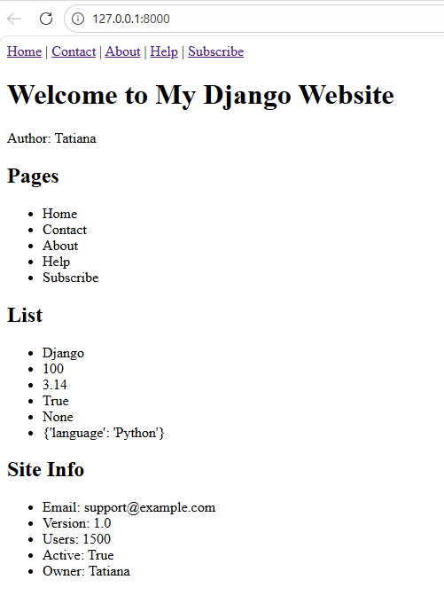
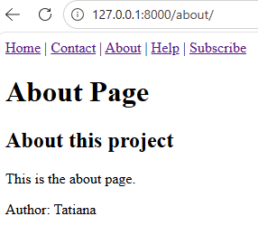
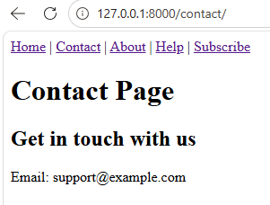
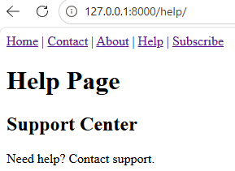
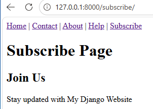

# Django Static Pages (No Templates)

## 📌 Project Description
This is a simple Django project built without templates.  
It uses `HttpResponse` to create static web pages and demonstrates basic Django routing and Python data structures.

---

## 🚀 Features

- 5 static pages:
  - Home
  - About
  - Contact
  - Help
  - Subscribe

- Navigation bar with links (`|` separator)
- Uses only `HttpResponse` (no templates)
- Basic HTML tags:
  - nav
  - h1
  - h2
  - p
  - ul / ol

---

## 🧠 Data Structures Used

### Variables (3 types)
- site_name → string
- year → integer
- rating → float

### List (6 mixed types)
- string
- integer
- float
- boolean
- None
- dictionary

### Dictionary (5 keys)
- email
- version
- users
- active
- owner

---

## Exemple
### code

config/settings.py
```Python
# Application definition

INSTALLED_APPS = [
    'django.contrib.admin',
    'django.contrib.auth',
    'django.contrib.contenttypes',
    'django.contrib.sessions',
    'django.contrib.messages',
    'django.contrib.staticfiles',
    'static_pages_no_templates',
    'static_pages_1'
]

```

config/urls.py
```Python
from django.contrib import admin
from django.urls import path
from static_pages_1 import views

urlpatterns = [
    path('', views.home, name="home"),
    path('contact/', views.contact, name="contact"),
    path('about/', views.about, name="about"),
    path('help/', views.help, name="help"),
    path('subscribe/', views.subscribe, name='subscribe'),
    
]


```

static_pages_no_templates/views.py
```Python

from django.http import HttpResponse

site_name = "My Django Website"
year = 2026
rating = 4.8

my_list = ["Django", 100, 3.14, True, None, {"language": "Python"}]

site_info = {
    "email": "support@example.com",   # string
    "version": 1.0,                   # float
    "users": 1500,                   # int
    "active": True,                  # boolean
    "owner": "Tatiana"               # string
}

pages = ["Home", "Contact", "About", "Help", "Subscribe"]

nav = """
    <nav>
        <a href='/'>Home</a> |
        <a href='/contact/'>Contact</a> |
        <a href='/about/'>About</a> |
        <a href='/help/'>Help</a> |
        <a href='/subscribe/'>Subscribe</a>
    </nav>
"""

home_body = f"""
<ol>
    <li>Site Name: {site_name}</li>
    <li>Year Created: {year}</li>
    <li>User Rating: {rating:.2f}</li>
</ol>
"""
 
    
def home(request):
    content = f"""
    {nav}
    <h1>Welcome to {site_name}</h1>
    <p>Author: {site_info['owner']}</p>
    <h2>Pages</h2>
    <ul>
        {"".join([f"<li>{p}</li>" for p in pages])}
    </ul>
    <h2>List</h2>
    <ul>
        {"".join([f"<li>{i}</li>" for i in my_list])}
    </ul>
    <h2>Site Info</h2>
    <ul>
        <li>Email: {site_info['email']}</li>
        <li>Version: {site_info['version']}</li>
        <li>Users: {site_info['users']}</li>
        <li>Active: {site_info['active']}</li>
        <li>Owner: {site_info['owner']}</li>
    </ul>
    """
    return HttpResponse(content)  


def contact(request):
    email = site_info.get('email', 'Not available')
    
    content = f"""
    <h1>Contact Page</h1>
    <h2>Get in touch with us</h2>
    <p>Email: {email}</p>
    """
    return HttpResponse(nav + content)

```

## 🌐 Rendering Pages

### Home
Displays site info, list, and dictionary data.


### About
Basic project information.


### Contact
Displays contact email.


### Help
Support information.


### Subscribe
Subscription page message.


---

## ⚙️ How to Run

```bash
python manage.py runserver

```

